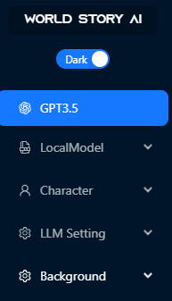

# WorldStory_AI


## Introduction

WroldStory_AI는 가상의 캐릭터를 생성하고 대화하는 프로젝트입니다.

## Installation

WorldStory_AI를 사용하기 위해서는 다음과 같은 프로그램을 설치하여야합니다.

- python 3.10 이상

- [Yarn](https://classic.yarnpkg.com/lang/en/docs/install/#windows-stable)

위의 프로그램을 설치하신뒤 `InstallKit.bat` 파일을 실행하여 프론트엔드, 백엔드 프로그램을 설치합니다.

만일 배치파일이 실행되지 않거나, 명령어로 설치하려면 WorldStory_AI 레파지토리를 클론한 뒤 아래의 명령어를 순서대로 입력해주세요

- frontend

```bash
cd ./frontend
```

```bash
yarn install
```

- backend

```bash
cd backend
```

```bash
python -m venv worldstory_backend
```

```bash
cd worldstory_backend/Scripts/
```

```bash
activate
```

```bash
cd ../../
```

```bash
pip install -r requirements.txt
```

## Installation-LlamaCPP

[Llama-cpp](https://github.com/abetlen/llama-cpp-python)를 사용하려면 아래의 라이브러리와 프로그램을 추가로 설치하세요

- [Cmake](https://cmake.org/download/)
- Visual Studio C++ 14.0 이상의 버전

```bash
pip install llama-cpp-python
```

## Getting Started

프론트엔드와 백엔드가 설치되었다면 `StartKit.bat` 파일을 실행하여 프로젝트를 실행합니다.

만일 배치파일이 실행되지 않거나, 명령어로 실행하려면 WorldStory_AI 레파지토리를 다운받은 폴더에서 2개의 터미널에서 아래의 명령어를 순서대로 입력해주세요

- frondend

```bash
cd ./frontend
```

```bash
yarn start
```

- backend

```bash
./backend
```

```bash
cd ./worldstory_backend/Scripts
```

```bash
activate
```

```bash
cd ../../
```

```bash
uvicorn main:app --reload
```

## Create Character


맨 처음 화면에서 Character setting 버튼을 클릭하여 캐릭터를 생성할 수 있습니다. GPT3.5 모델과 로컬 Llama 모델([GGML](https://github.com/ggerganov/ggml)) 둘 중 하나를 선택하여 캐릭터를 만들 수 있습니다.

- 지원되는 Llama 모델
  - openbuddy-llama2-13b-v11.1.ggmlv3
  - puddlejumper-13b.ggmlv3
  - WizardLM-13B-1.0
  - kimiko-7b.ggmlv3
  - Kimiko-v2-13B-GGML

Llama 모델을 HuggingFace에서 bin파일 형식으로 다운받은 뒤, [backend/Models](./backend/Models) 폴더에 넣으면 인식됩니다.

⚠️ 로컬 Llama 모델은 아직 테스트 단계입니다. 프롬프트 및 이미지 생성 기능은 모두 GPT3.5를 기반으로 만들어져있습니다.

`Model select` 에서 GPT3.5를 클릭하신 뒤 `Generate` 버튼을 클릭하면 캐릭터를 생성합니다.

생성된 캐릭터와 대화하려면
`Save setting` 버튼을 클릭하여 [backend/Characters](./backend/Characters) 폴더에 저장하세요.

## User config

캐릭터를 생성하고 대화하기 전, 유저의 이름, 사진과 원하는 시대,이름,성별의 캐릭터를 설정할 수 있습니다. [backend/Characters/User](./backend/Characters/User/) 폴더의 `UserConfig.ini` 파일을 수정하여 유저 프로필을 만드세요.


`language` 옵션으로 원하는 언어로 대화할 수 있지만, 캐릭터를 생성할때는 **영어로 고정**됩니다. 생성된 캐릭터의 외형을 기반으로 이미지를 생성해야하는데 이 기능은 영어일때만 동작합니다.

`memory` 옵션은 대화를 할때 캐릭터가 기억할 수 있는 대화의 수입니다. memory가 높을수록 더 이전의 대화를 기억할 수 있지만, 토큰의 길이가 초과될 경우 일부 정보가 소실될 수 있으니 적절한 값으로 설정해야합니다.

`era` 옵션은 캐릭터를 생성할 때, 자신이 원하는 시대의 캐릭터(예 : 판타지, 사이버펑크, 디스토피아)를 설정할 수 있습니다. 값이 비어있으면 랜덤으로 생성합니다.

`gender` 및 `name` 옵션 또한 캐릭터를 생성할 떄 성별과 이름을 지정할 수 있습니다. 값이 비어있으면 랜덤으로 생성합니다.


프로필 이미지를 변경하고 싶으면, [/backend/Characters/User](./backend/Characters/User/) 경로의 기존의 이미지를 삭제하고 원하는 이미지로 대체하면 변경됩니다.

## Chat with Character


`Chat with Character` 버튼을 클릭하여 자신이 생성한 캐릭터와 대화할 수 있습니다.



### GPT3.5 or LocalModel

대화를 할 모델로써 `GPT3.5` 와 `LocalModel` 을 선택할 수 있습니다. 기본값은 GPT3.5로 설정되어있습니다.

⚠️ `LocalModel` 은 개발중입니다. 현재는 GPT3.5만 동작합니다.

### Character

Character setting 에서 캐릭터를 생성하면 `Character` 섹션을 선택하여 원하는 캐릭터와 대화하세요.

### LLM Setting

LocalModel에서 설정할 수 있는 파라미터 값입니다.

⚠️ `LLM Setting` 은 개발중입니다. 현재는 GPT3.5만 동작합니다.

### Background

자신의 캐릭터의 시대에 맞게 배경을 변경할 수 있습니다. 판타지, 사이버펑크, 서부시대, 아포칼립스 배경 중 하나를 선택할 수 있습니다.
