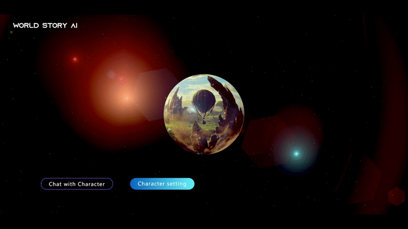
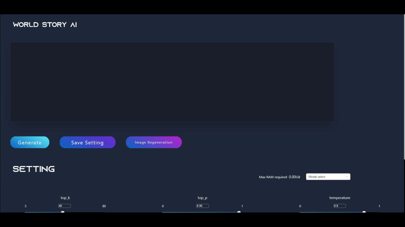
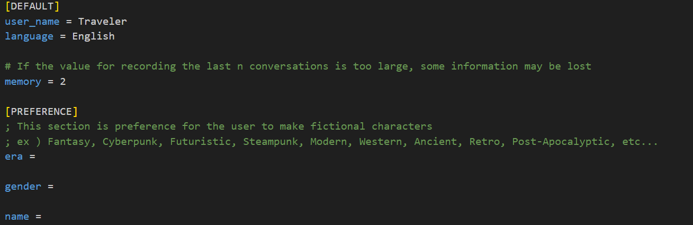

# WorldStory_AI



## Introduction

WroldStory_AI는 가상의 캐릭터를 생성하고 대화하는 프로젝트입니다.

## Installation

WorldStory_AI를 사용하기 위해서는 다음과 같은 프로그램을 설치하여야합니다.

- python 3.10 (⚠️ 3.11 이상은 작동이 안됩니다.)

- [Yarn](https://classic.yarnpkg.com/lang/en/docs/install/#windows-stable)

위의 프로그램을 설치하신뒤 `InstallKit.bat` 파일을 실행하여 프론트엔드, 백엔드 프로그램을 설치합니다.

만일 배치파일이 실행되지 않거나, 명령어로 설치하려면 WorldStory_AI 레파지토리를 클론한 뒤 아래의 명령어를 순서대로 입력해주세요

- frontend

```bash
cd ./frontend
```

```bash
yarn install
```

- backend

```bash
cd backend
```

```bash
python -m venv worldstory_backend
```

```bash
cd worldstory_backend/Scripts/
```

```bash
activate
```

```bash
cd ../../../
```

```bash
pip install -r requirements.txt
```

## Installation-LlamaCPP

Llama-cpp를 사용하려면 아래의 라이브러리와 프로그램을 추가로 설치하세요

- [Cmake](https://cmake.org/download/)
- Visual Studio C++ 14.0 이상의 버전

```bash
pip install llama-cpp-python
```

## Getting Started

프론트엔드와 백엔드가 설치되었다면 `StartKit.bat` 파일을 실행하여 프로젝트를 실행합니다.

만일 배치파일이 실행되지 않거나, 명령어로 실행하려면 WorldStory_AI 레파지토리를 다운받은 폴더에서 2개의 터미널에서 아래의 명령어를 순서대로 입력해주세요

- frondend

```bash
cd ./frontend
```

```bash
yarn start
```

- backend

```bash
./backend
```

```bash
cd ./worldstory_backend/Scripts
```

```bash
activate
```

```bash
cd ../../
```

```bash
uvicorn main:app --reload
```

## Create Character



맨 처음 화면에서 Character setting 버튼을 클릭하여 캐릭터를 생성할 수 있습니다. GPT3.5 모델과 로컬 Llama 모델([GGML](https://github.com/ggerganov/ggml)) 둘 중 하나를 선택하여 캐릭터를 만들 수 있습니다.

- 지원되는 Llama 모델
  - openbuddy-llama2-13b-v11.1.ggmlv3
  - puddlejumper-13b.ggmlv3
  - WizardLM-13B-1.0
  - kimiko-7b.ggmlv3
  - Kimiko-v2-13B-GGML

⚠️ 로컬 Llama 모델은 아직 테스트 단계입니다. 프롬프트 및 이미지 생성 기능은 모두 GPT3.5를 기반으로 만들어져있습니다.

`Model select` 에서 GPT3.5를 클릭하신 뒤 `Generate` 버튼을 클릭하면 캐릭터를 생성합니다.

생성된 캐릭터와 대화하려면
`Save setting` 버튼을 클릭하여 [backend/Characters](./backend/Characters) 폴더에 저장하세요.

## User config

캐릭터를 생성하고 대화하기 전, 유저의 이름, 사진과 원하는 시대,이름,성별의 캐릭터를 설정할 수 있습니다. [backend/Characters/User](./backend/Characters/User/) 폴더의 `UserConfig.ini` 파일을 수정하여 유저 프로필을 만드세요.



`language` 옵션으로 원하는 언어로 대화할 수 있지만, 캐릭터를 생성할때는 **영어로 고정**됩니다. 생성된 캐릭터의 외형을 기반으로 이미지를 생성해야하는데 이 기능은 영어일때만 동작합니다.

`memory` 옵션은 대화를 할때 캐릭터가 기억할 수 있는 대화의 수입니다. memory가 높을수록 이전의 대화를 기억할 수 있지만, 토큰의 길이가 초과될 경우 일부 정보가 소실될 수 있으니 적절한 값으로 설정해야합니다.
